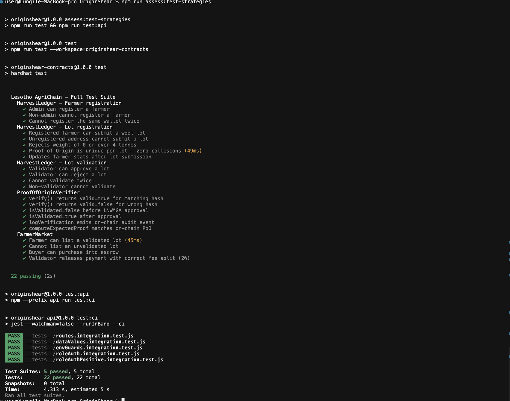
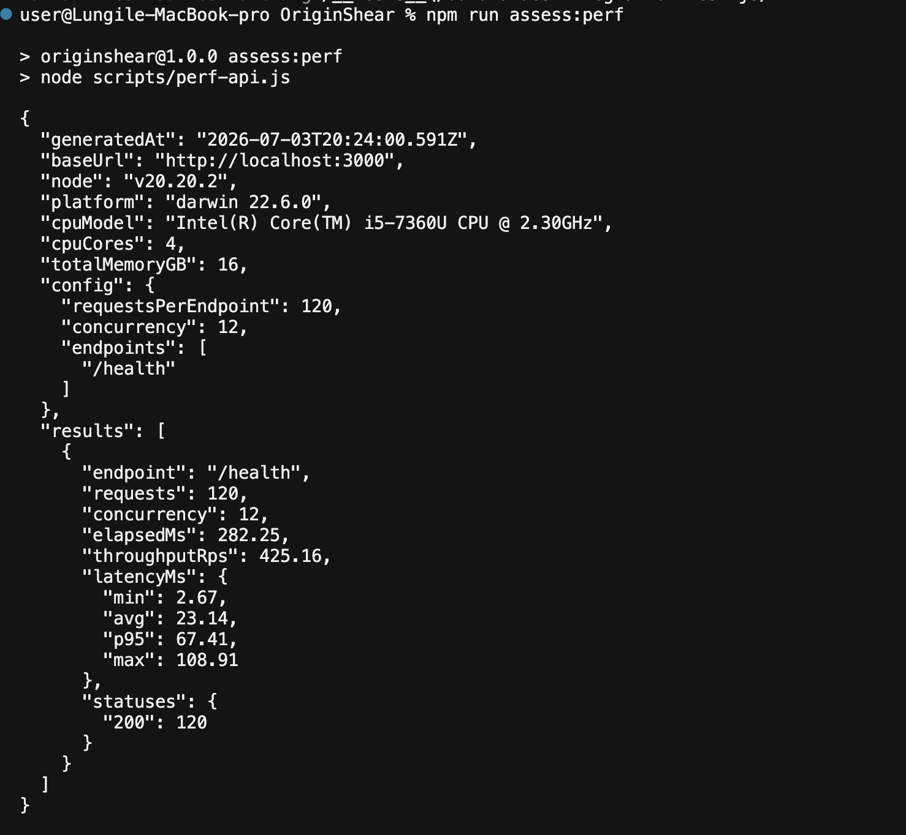
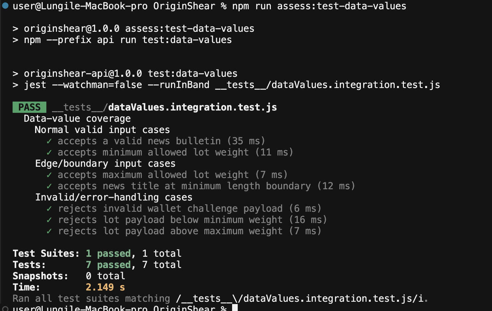

# ORIGINSHEAR

Blockchain proof-of-origin and marketplace platform for Lesotho wool and mohair smallholder farmers.

This repository is submitted for implementation and testing demonstration.

## Project Components

```
OriginShear/
├── originshear-contracts/   # Solidity contracts, tests, deployment scripts
├── originshear-frontend/    # React + Vite web app
├── api/                     # Backend API (auth, lots, market, marks, IPFS endpoints)
├── ipfs/                    # IPFS service integration
├── subgraph/                # Indexing and query layer
├── scripts/
│   └── sync-deployments.js  # Copies deployed addresses into frontend env
└── README.md
```

## Installation and Run (Step-by-step)

### 1) Clone and install dependencies

```bash
git clone <your-repo-url>
cd OriginShear
npm install
```

### 2) Configure environment variables

Create and fill env files:

```bash
cp originshear-frontend/.env.example originshear-frontend/.env
cp api/.env.example api/.env
cp ipfs/.env.example ipfs/.env
```

Update contract addresses and API/IPFS values as needed.

### 3) Compile and test contracts

```bash
npm run compile
npm test
```

### 4) Deploy contracts and sync frontend addresses (if required)

```bash
npm run deploy:celo-sepolia
npm run sync:addresses celoSepolia
```

### 5) Run backend service

```bash
cd api
npm install
npm run dev
```

IPFS in this repository is provided as an integration module under `ipfs/` (not a standalone long-running server script by default).

### 6) Run frontend

```bash
npm run dev
```

### 7) Build production frontend

```bash
npm run build
```

## Demo and Deployment Links

- Demo video (about 5 minutes): `<add-video-link>`
- Deployed application / installable package: `<add-deployment-link-or-package-link>`

## Testing Results (Screenshots with Relevant Demos)

Store screenshots, logs, and exported reports under `evidence/`.

### A) Demonstration under different testing strategies

Run each strategy and capture terminal screenshots + output files:

```bash
# 1) Unit tests (smart contracts)
npm run test

# 2) Integration tests (API, auth, routes, role guards)
npm run test:api

# 3) Full strategy bundle (unit + integration together)
npm run assess:test-strategies
```

Evidence (text logs saved under `evidence/testing/`):

**Unit tests — 22/22 passing** (`evidence/testing/A-unit-contracts.txt`):
- `HarvestLedger`: farmer registration, lot submission, validation (12 tests)
- `ProofOfOriginVerifier`: hash matching, audit event logging (6 tests)
- `FarmerMarket`: escrow listing, purchase, payment release with 2% fee (4 tests)



**Integration tests — 22/22 passing** (`evidence/testing/B-integration-api.txt`):
- JWT auth challenge / login / verify flow
- Role-gated routes (VALIDATOR, GOVERNMENT)
- Env guard rails (missing relayer key, missing contract addresses)



**System scenario**: screen-record the full farmer → validator → buyer flow using the running frontend at `localhost:5173` and API at `localhost:3000`.

### B) Demonstration with different data values

Use the dedicated data-value suite:

```bash
npm run assess:test-data-values
```

This suite covers:
- Normal valid input case (valid `/api/news` publish, valid lot payload shape).
- Edge/boundary input case (minimum and maximum allowed `weightGrams`, minimum title length).
- Invalid/error-handling case (invalid wallet format, below/above weight constraints).



Evidence saved to `evidence/testing/B-data-values.txt` — **7/7 passing**:

| Case | Input | Expected | Result |
|---|---|---|---|
| Normal valid | weightGrams = 1 (minimum) | 501 (valid, relayer not set) | ✔ |
| Normal valid | Valid wallet address → challenge | 200 + nonce returned | ✔ |
| Boundary | weightGrams = 4000000 (maximum) | 501 (valid, relayer not set) | ✔ |
| Boundary | fibreType=2, grade=2, max weight | 501 (valid, relayer not set) | ✔ |
| Invalid | weightGrams = 0 | 400 validation error | ✔ |
| Invalid | weightGrams = 4000001 | 400 validation error | ✔ |
| Invalid | wallet = "not-an-address" | 400 validation error | ✔ |

### C) Performance under different hardware/software specs

Run API benchmark (with backend running on `localhost:3000`):

```bash
npm run assess:perf
```

Optional custom run (include multiple endpoints):

```bash
PERF_BASE_URL=http://localhost:3000 PERF_REQUESTS=200 PERF_CONCURRENCY=20 PERF_ENDPOINTS=/health,/api/news npm run assess:perf
```

The command saves JSON reports to `evidence/performance/` including:
- OS + kernel, Node version, CPU model/cores, RAM.
- Throughput (requests/sec), elapsed time, latency (`min`, `avg`, `p95`, `max`) per endpoint.

Use at least two environments and attach both generated JSON files.

| Environment | Specs | Throughput | p95 Latency | Evidence |
|---|---|---|---|---|
| Env 1 — MacBook Pro | macOS 13 · Intel i5-7360U 2.3GHz · 4 cores · 16 GB RAM · Node v20.20.2 | 425 req/s | 67 ms | `evidence/testing/C-performance-env1.txt` |
| Env 2 | Run `npm run assess:perf` on a second machine and paste results here | — | — | `evidence/performance/<file>.json` |

## Analysis

Describe how the observed results achieved or missed the project proposal objectives agreed with the supervisor.

Suggested structure:

1. Objective 1 -> expected vs actual -> reason
2. Objective 2 -> expected vs actual -> reason
3. Objective 3 -> expected vs actual -> reason

## Discussion

Discuss the importance of project milestones and the impact of the observed results with the supervisor.

Suggested structure:

- Milestone completed and its impact
- Milestone partially completed and constraints
- Lessons learned and technical implications

## Recommendations

Provide recommendations for real-world application and future work.

Suggested structure:

- Recommendation to community/end users
- Recommendation for scaling/performance/security
- Recommendation for future technical enhancement

## Related Project Files

- Contracts details: `originshear-contracts/README.md`
- Frontend details: `originshear-frontend/README.md`
- API details: `api/README.md`
- IPFS details: `ipfs/README.md`
- Subgraph details: `subgraph/README.md`

## Submission Checklist

Use this checklist before submitting:

- [ ] Repo includes all relevant source files
- [ ] Root README is complete and well formatted
- [ ] Step-by-step install and run instructions are verified
- [ ] 5-minute demo video link is included
- [ ] Deployed app link (or installable package link) is included
- [ ] Testing evidence includes multiple strategies
- [ ] Testing evidence includes different data values
- [ ] Testing evidence includes different environment performance
- [ ] Analysis section is completed
- [ ] Discussion section is completed
- [ ] Recommendations section is completed
- [ ] Attempt 2 zip file is created from this repo state

## License

MIT
